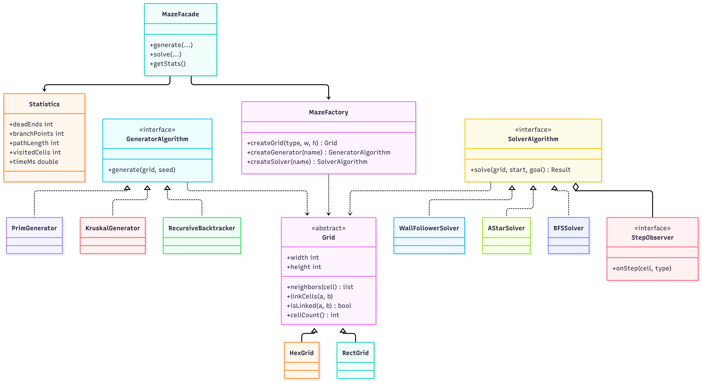
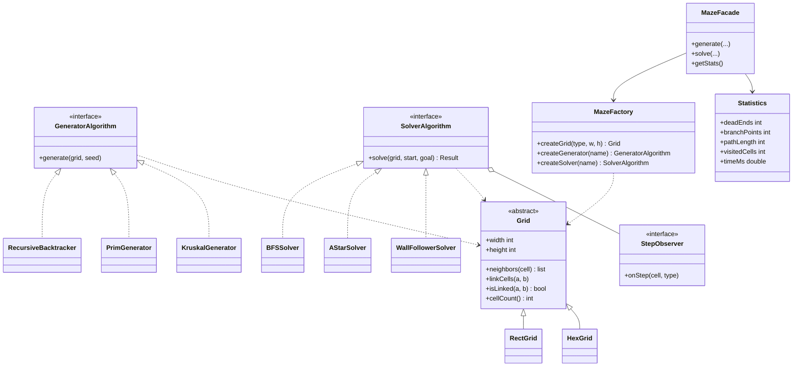

# Діаграма класів

```mermaid
classDiagram
    class Grid {
        <<abstract>>
        +width int
        +height int
        +neighbors(cell) list
        +linkCells(a, b)
        +isLinked(a, b) bool
        +cellCount() int
    }
    class RectGrid
    class HexGrid
    Grid <|-- RectGrid
    Grid <|-- HexGrid

    class GeneratorAlgorithm {
        <<interface>>
        +generate(grid, seed)
    }
    class RecursiveBacktracker
    class PrimGenerator
    class KruskalGenerator
    GeneratorAlgorithm <|.. RecursiveBacktracker
    GeneratorAlgorithm <|.. PrimGenerator
    GeneratorAlgorithm <|.. KruskalGenerator

    class SolverAlgorithm {
        <<interface>>
        +solve(grid, start, goal) Result
    }
    class BFSSolver
    class AStarSolver
    class WallFollowerSolver
    SolverAlgorithm <|.. BFSSolver
    SolverAlgorithm <|.. AStarSolver
    SolverAlgorithm <|.. WallFollowerSolver

    class StepObserver {
        <<interface>>
        +onStep(cell, type)
    }
    class MazeFactory {
        +createGrid(type, w, h) Grid
        +createGenerator(name) GeneratorAlgorithm
        +createSolver(name) SolverAlgorithm
    }
    class MazeFacade {
        +generate(...)
        +solve(...)
        +getStats()
    }
    class Statistics {
        +deadEnds int
        +branchPoints int
        +pathLength int
        +visitedCells int
        +timeMs double
    }

    GeneratorAlgorithm ..> Grid
    SolverAlgorithm ..> Grid
    SolverAlgorithm o-- StepObserver
    MazeFactory ..> Grid
    MazeFacade --> MazeFactory
    MazeFacade --> Statistics
```